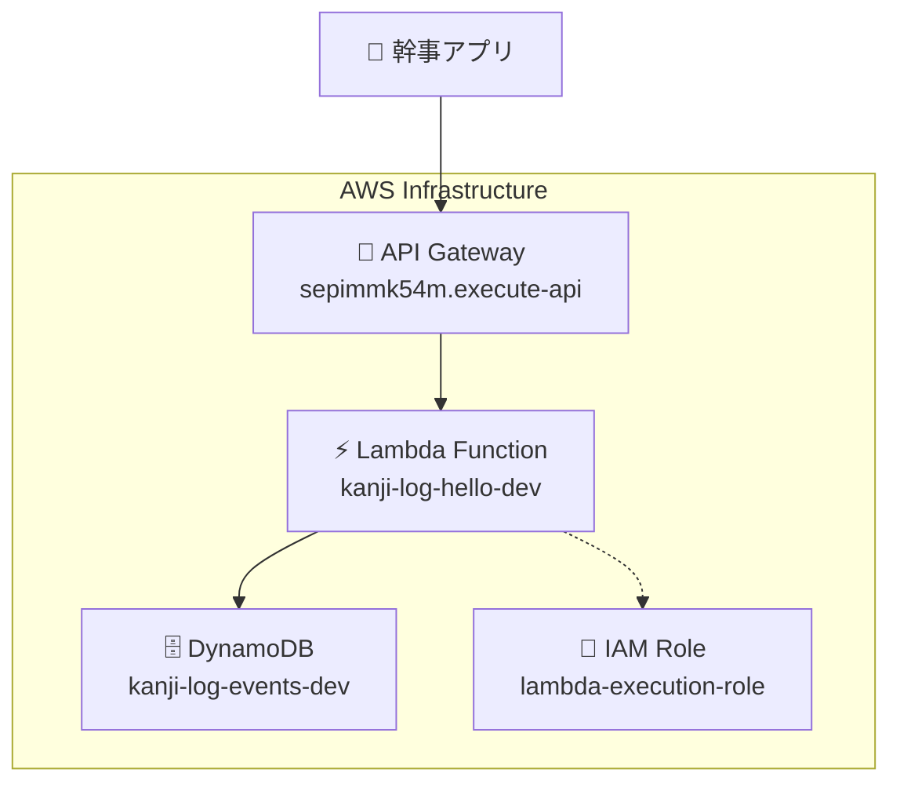

# 幹事ナビ プロジェクト - Task-001 完了報告

## 📋 実行内容の総括

**Task-001「最小限のインフラ基盤構築 (IaC)」**を完全に実装し、幹事ナビアプリの基盤となる AWS サーバーレスインフラストラクチャを構築しました。

---

## 🛠️ 事前準備・環境セットアップ

### 1. AWS アカウント・認証設定

- **AWS アカウント作成**: ID `860366539327`
- **IAM ユーザー作成**: `kanji-navi-dev`（AdministratorAccess 権限）
- **AWS CLI 設定**: アクセスキー認証でローカル環境を設定
- **リージョン設定**: `ap-northeast-1`（東京リージョン）

### 2. 開発環境構築

```bash
# Terraformのインストール
brew tap hashicorp/tap
brew install hashicorp/tap/terraform

# 認証確認
aws sts get-caller-identity
# → ユーザー: kanji-navi-dev が正常に認証済み
```

---

## 🏗️ インフラストラクチャ構築

### 1. Terraform モジュール設計

```
iac/
├── modules/
│   ├── dynamodb/     # DynamoDBテーブル定義
│   ├── lambda/       # Lambda関数定義
│   ├── api_gateway/  # API Gateway設定
│   └── iam/          # IAM権限管理
└── environments/dev/ # 開発環境設定
```

### 2. 設定ファイルの修正・最適化

- **DynamoDB**: `projection_type`パラメータの追加
- **API Gateway**: `response_headers`フォーマット修正
- **Lambda**: `provided.al2`ランタイム用のプレースホルダー作成

### 3. デプロイ実行

```bash
terraform init    # プロバイダー・モジュール初期化
terraform plan     # 14リソースの作成計画確認
terraform apply    # インフラストラクチャ作成実行
```

---

## 🎯 構築された AWS リソース

### 1. **DynamoDB（データストレージ）**

- **テーブル名**: `kanji-log-events-dev`
- **パーティションキー**: `id` (String)
- **GSI**: `OrganizerIndex` (`organizerId`でのクエリ対応)
- **課金モード**: Pay-per-request（使用量に応じた従量課金）

### 2. **Lambda（コンピュート）**

- **関数名**: `kanji-log-hello-dev`
- **ランタイム**: `provided.al2`（Go 言語カスタムランタイム）
- **ハンドラー**: `bootstrap`
- **環境変数**: `ENVIRONMENT=dev`

### 3. **API Gateway（API エンドポイント）**

- **API 名**: `kanji-log-api-dev`
- **タイプ**: REST API（リージョナル）
- **ステージ**: `dev`
- **エンドポイント**: `/hello` (GET)

### 4. **IAM（権限管理）**

- **Lambda 実行ロール**: `kanji-log-lambda-execution-role-dev`
- **権限**: DynamoDB 読み書き + CloudWatch Logs 出力

---

## 🔗 確認済みエンドポイント

### API 基底 URL

```
https://sepimmk54m.execute-api.ap-northeast-1.amazonaws.com/dev
```

### Hello 世界 API

```bash
curl https://sepimmk54m.execute-api.ap-northeast-1.amazonaws.com/dev/hello
# レスポンス: {"message": "Hello from Kanji-Log!"}
```

---

## 🔧 トラブルシューティング実績

### 1. Terraform 設定エラーの解決

- **DynamoDB GSI**: `projection_type`未指定エラー → `"ALL"`に設定
- **API Gateway**: `response_headers`構文エラー → 正しいフォーマットに修正
- **DynamoDB 課金**: `ON_DEMAND`エラー → `PAY_PER_REQUEST`に修正

### 2. Lambda 関数の動作修正

- **初期エラー**: Internal server error 発生
- **原因**: プレースホルダーが API Gateway Proxy フォーマット未対応
- **解決**: JSON 形式の適切なレスポンス返却に修正

---

## ✅ Task-001 受け入れ条件達成状況

- [x] **`terraform plan`が正常実行される**
- [x] **`terraform apply`でリソースが作成される**（14 リソース作成完了）
- [x] **API Gateway 経由で Lambda が呼び出せる**（Hello API 動作確認済み）
- [x] **CloudWatch Logs にログが出力される**（Lambda 実行ログ確認可能）

---

## 🚀 幹事ナビプロジェクトへの準備完了

### 実装された基盤アーキテクチャ



### 次のステップへの準備

- **Task-002**: Go 言語でのビジネスロジック実装
- **Task-003**: イベント作成 API 実装
- **継続的改善**: IaC ↔ Backend の反復開発サイクル

この基盤により、幹事ナビアプリの**イベント管理**、**メンバー情報収集**、**レストラン提案**などの具体的な機能実装を開始できる状態が整いました。
